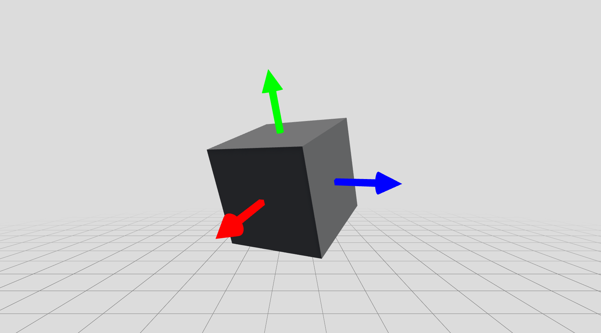

# XRC Core

A collection of core utility scripts and starter assets to be used by XR Collaboratory.

## Technical details

### Package

* Name: edu.cornell.xrc.toolkit.core
* Display name: XRC Core
* Version: 0.2.0

### Requirements

This version of the XRC Core package is compatible with the following versions of the Unity Editor:

* 6000.0 and later

### Dependencies

The XRC Core package has the following dependencies which are automatically added to your project when installing:

* com.unity.inputsystem@1.11.2
* com.unity.xr.interaction.toolkit@3.0.7

If the package has additional Git dependencies listed in the package description, such as XRC Toolkit packages, then they need to be installed manually via the Unity Package Manager.

### Installation

To install the package, follow these steps:
1. In the Unity Editor, click on **Window > Package Manager**
2. Click the + button and choose **Add package from git URL** option
3. Enter the package's Git URL. Make sure the URL has ".git" ending.
4. If the repository is private, you will be asked to authenticate via your GitHub account. If you haven't been granted access to the repository you will not be able to install the package.
5. The package should be installed into your project.
6. You can download the package samples from under the Samples tab in the Package Manager

From Unity: [Install a UPM package from a Git URL](https://docs.unity3d.com/6000.0/Documentation/Manual/upm-ui-giturl.html)

> [!NOTE]
> Even though the package documentation is public, the package itself and its repository might be private and not accessible. If you haven't been granted access to the repository you will not be able to install the package.

